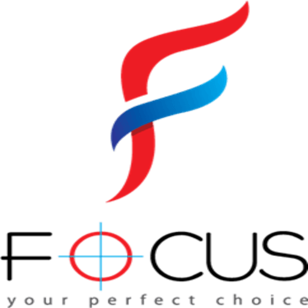

# 🚀 FocusForge



> **Your Productivity Companion**

---

## ✨ Features

- ⏲️ **Pomodoro Timer** — Stay focused with customizable work/break intervals
- 📋 **Task Management** — Add, complete, and organize your daily tasks
- 🔔 **Smart Notifications** — Get reminders for overdue tasks & session completions
- 📱 **PWA & Android APK** — Install on any device, or use as a native Android app!
- 🎨 **Modern UI** — Clean, responsive, and easy-to-use interface

---

## 📦 Download & Install

### 👉 [Download Latest APK](https://github.com/legendxdevil/focus-forge/releases/latest/download/FocusForge.apk)

> _Just tap and install on your Android device!_

### 💻 Run Locally

```bash
# Clone the repo
git clone https://github.com/legendxdevil/focus-forge.git
cd focus-forge

# Install dependencies
npm install

# Start development server
npm run dev
```

### 🌐 Use as PWA
- Open the deployed site in Chrome
- Click **Install App** or **Add to Home Screen**

---

## 🖼️ Screenshots

| Home | Pomodoro | Tasks |
|------|----------|-------|
|  |  |  |

> _Add your own screenshots in the `public/` folder for better preview!_

---

## 🛠️ Tech Stack
- React + TypeScript
- Vite
- PWA (vite-plugin-pwa)
- Capacitor (for Android APK)
- LocalStorage, Notification API

---

## 🤝 Contributing

1. Fork this repo
2. Create your feature branch (`git checkout -b feature/AmazingFeature`)
3. Commit your changes (`git commit -m 'Add some AmazingFeature'`)
4. Push to the branch (`git push origin feature/AmazingFeature`)
5. Open a Pull Request

---

## 📄 License

This project is licensed under the MIT License — see the [LICENSE](LICENSE) file for details.

---

## 🙏 Credits

- App Icon: [seeklogo.com](https://seeklogo.com/images/F/focus-logo-4805899AB0-seeklogo.com.png)
- Built with ❤️ by [legendxdevil](https://github.com/legendxdevil)

---

> **FocusForge** — _Turn your focus into results!_ 🏆
